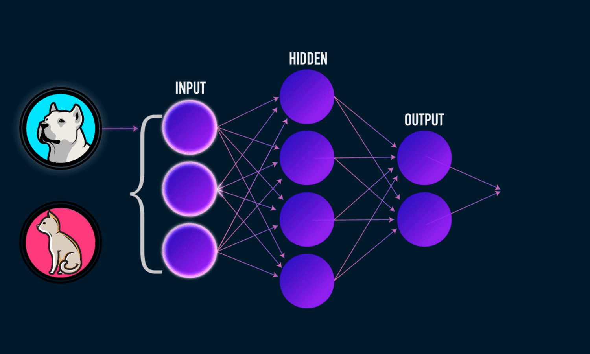
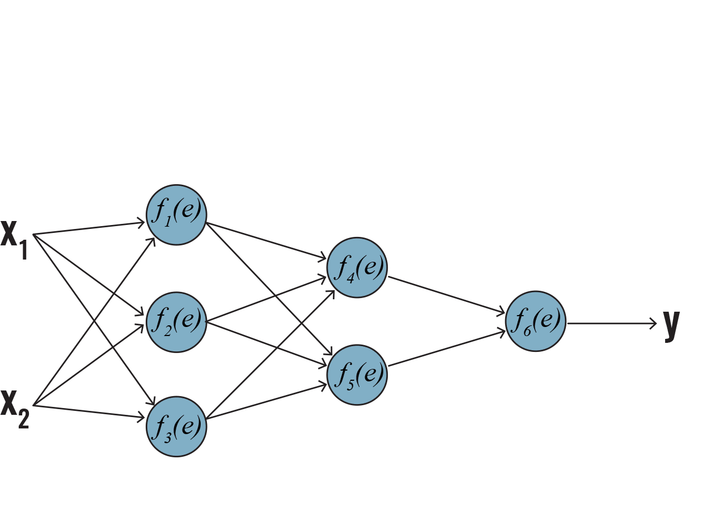
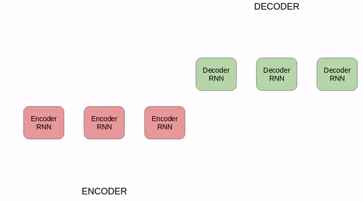
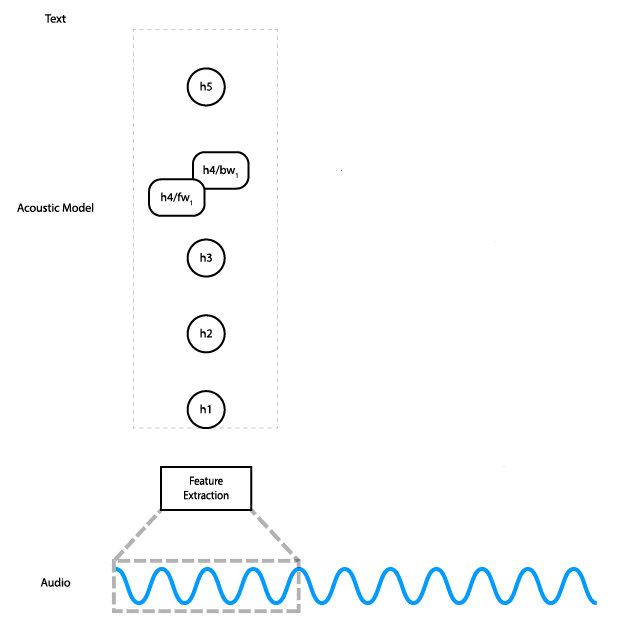

   
   

## Course Description
Welcome ! You just found the repository of resource materials for  
<b> Neural Networks and Fuzzy Systems (CSE-433) </b>  & 
<b> Computer Vision & Robotics (CSE-437) </b> 
courses offered by MIU at Fall 2019 trimester.  

## Course Outline
 <a href="./CSE-433/course_outline_nn.pdf">[CSE-433]</a>  <a href="./CSE-437/course_outline_cv.pdf">[CSE-437]</a>

## Course Discussion
For any academic questions ask <a href="https://github.com/Mahedi-61/MIU_Fall_2019/issues/new">here</a>  
Give your anonymous feedback <a href="https://forms.gle/JzxMGb3VfQLDR9Px8">here</a>

## Course Project Details
<a href="./project/instructions_for_the_lab_project.pdf">Lab Project  </a> <a href="./project/team_list.pdf">   Team List</a> 
<b>Video Tutorial for the Project:</b> <a href="https://www.youtube.com/playlist?list=PLPOJueyJKNce2cs77niLmbpADKwF7h_av">here/a> 

## Announcement  
* [23/09/2019]: There wil be no class for both courses in <b>28/09/2019</b> and <b>29/09/2019</b> :cry:
* [06/10/2019]: <a href="./CSE-433/home_work/home_work_1.pdf">Homework-1</a> for Neural Network (CSE-433) course. Due <b>12/10/2019</b> for section-A & <b>15/10/2019</b> for section-B 
* [17/10/2019]: <b>Mid-term exam syllabus</b>   
For CSE-437: First four topic mentioned in the <a href="./CSE-437/course_outline_cv.pdf">outline</a>. Previous year<a href="./CSE-437/exam/prev_year/"> questions</a>  with slighty different syllabus.  
For CSE-433:  <a href="./CSE-433/introduction/introduction_to_deep_learning.pdf">introduction, </a> 
<a href="./CSE-433/feed_forwad_nn/">feed_forward, </a> <a href="./CSE-433/backpropagation/nn_and_backprop.pdf"> backprop, </a>
<a href="./CSE-433/train_nn"> training neural_network </a>. Video explanation: <a href="https://www.youtube.com/playlist?list=PL6Xpj9I5qXYEcOhn7TqghAJ6NAPrNmUBH"> here </a>
* [24/10/2019]: Exam questions with solution to the <a href="./CSE-433/home_work/solution_home_work1.pdf">Homework-1 </a> for Neural Network (CSE-433) course has been uploaded. 
